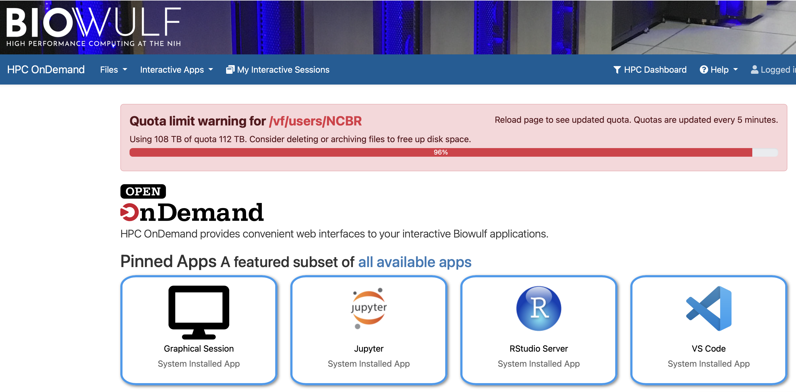
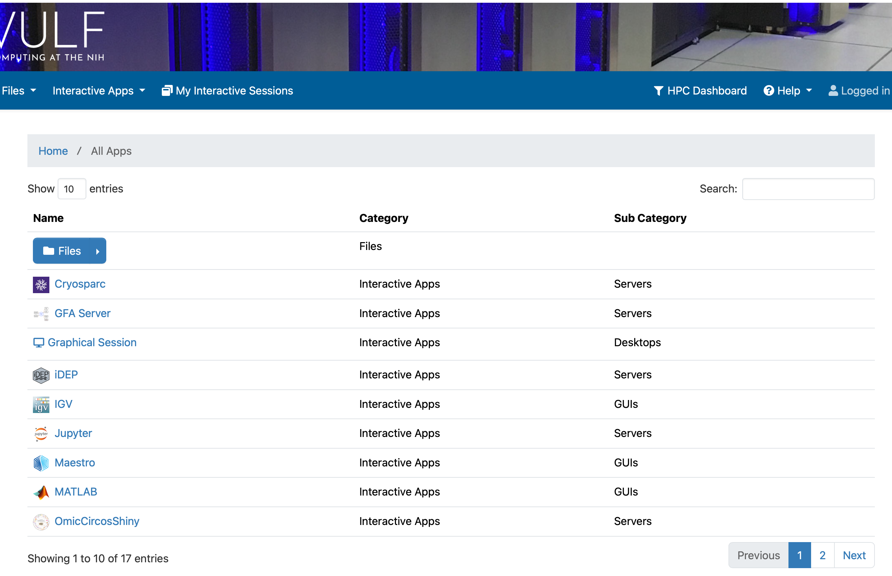
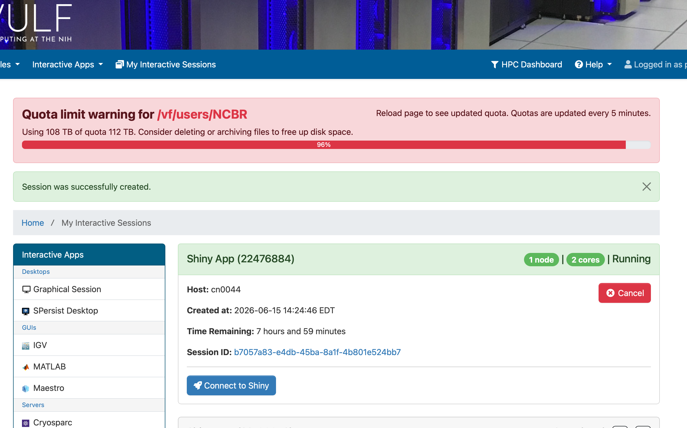
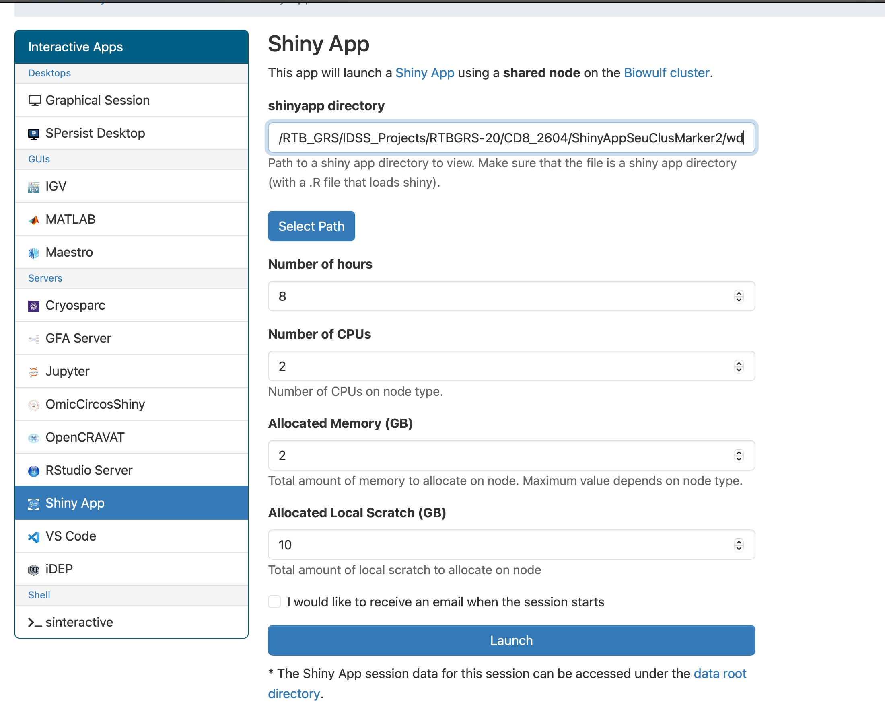

# Accessing Single-Cell Analysis Results via Shiny App

**NIH · Biowulf HPC · HPC OnDemand** · [hpcondemand.nih.gov](https://hpcondemand.nih.gov)

---

These instructions will guide you through launching a **Shiny App** on the NIH Biowulf HPC cluster via HPC OnDemand to interactively explore single-cell analysis results. No command-line experience is required. Please have your **PIV card and PIN** ready before you begin.

> **Note:** You must be on the NIH network or connected via VPN for this site to be accessible.

---

## Step 1 — Navigate to the HPC OnDemand Portal

Open your web browser and go to **https://hpcondemand.nih.gov**. When prompted, authenticate using your **NIH PIV card and PIN**. You will land on the HPC OnDemand home page.



---

## Step 2 — Open the All Available Apps List

From the home page, click **"Interactive Apps"** in the top navigation bar and select **"All Apps"**, or click the **"all available apps"** link on the home page. A paginated list of all available applications will appear.



---

## Step 3 — Navigate to Page 2 to Find the Shiny App

The Shiny App may not appear on the first page. Click **"2"** or **"Next"** at the bottom-right corner of the app list to go to page 2. Locate and click on **"Shiny App"**.



---

## Step 4 — Configure the Shiny App Session

The Shiny App configuration form will open. Fill in the fields as follows.

**① Shiny App Directory** — Paste the path provided to you by the bioinformatics team into the *"shinyapp directory"* field:

```
[ Your path will be provided — e.g. /RTB_GRS/IDSS_Projects/RTBGRS-20/CD8_2604/ShinyAppSeuClusMarker2/wd ]
```

You can also use the **"Select Path"** button to browse the file system manually.

**② Recommended settings:**

| Setting | Recommended Value | Notes |
|---|---|---|
| Number of Hours | 4–8 hours | Set based on how long you plan to explore |
| Number of CPUs | 2 | Default is sufficient |
| Allocated Memory (GB) | **20 GB** | ⚠️ Increase from default 2 GB — required for single-cell data |
| Allocated Local Scratch (GB) | 10 | Default is fine |

> ⚠️ **Important:** Single-cell datasets can be large. Setting **Allocated Memory to at least 20 GB** is strongly recommended to prevent the app from crashing or running slowly.

Once all fields are filled in, click the large **"Launch"** button at the bottom of the form.



---

## Step 5 — Wait for the Session to Start, Then Connect

After clicking Launch, you will be redirected to the **My Interactive Sessions** page. Biowulf needs to allocate resources for your session — this typically takes **1–2 minutes**. A green banner will confirm the job was submitted successfully:

> ✅ *"Session was successfully created."*

> ⏳ **Please be patient.** Do not click Launch again. If the *"Connect to Shiny"* button does not appear after a couple of minutes, refresh the page using your browser's reload button.

Once the session is running, a blue **"Connect to Shiny"** button will appear on the session card. Click it to open the interactive app in a new browser tab.


---

## 🎉 You're in!

The Shiny app will open in your browser. You can now interactively explore your single-cell analysis results — browse clusters, view marker genes, generate plots, and more.

### ⏳ A note on loading times

Depending on the number of cells in your dataset, some tabs may take a moment to render — particularly pages that display multiple figures side by side, such as the **Dimensionality Reduction (DimRed)** page. This is completely normal and expected for large datasets. We kindly ask for your patience while the visualizations load; they will appear shortly.

For smaller datasets with fewer cells, most views will load instantly.

### Session management

Your session will run for the number of hours you specified. To end early, return to **My Interactive Sessions** and click **"Cancel"**. Unused sessions still consume cluster resources, so please cancel when finished.

---

*NIH · Biowulf HPC OnDemand · hpcondemand.nih.gov | HPC Support: hpc.nih.gov | For analysis questions, contact your bioinformatics team*
